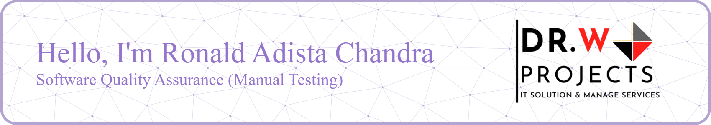

I am an experienced Software Quality Assurance Specialist (Manual Tester) with expertise in functional testing and exploratory testing. This experience has driven me to deepen my knowledge of API testing (Postman), automation (Katalon), and performance testing (JMeter). In the process, I have been trained to think systematically, maintain high accuracy, and be process-oriented. Therefore, I personally believe that teamwork and user satisfaction are of utmost importance.

##### Tools
     

##### Contact
  

 )
